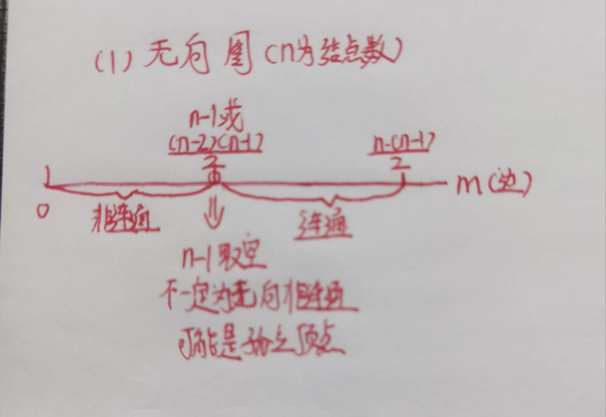
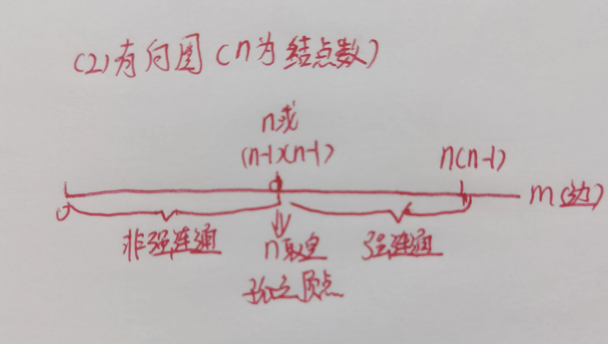

# 408数据结构-必背公式

## 1. m 阶 B-树

### 🏷️ 符号约定

> 先把符号看明白，后面所有公式直接套用，不用再回翻。

|                                                          符号                                                          | 含义                 | 备注|
| :--------------------------------------------------------------------------------------------------------------------: | :------------------- | :--------------------------|
|       $m$        | **阶**（一棵 B-树的"宽度上限"） | 每个结点最多允许$m-1$ 个关键字，最多 $m$ 棵子树|
|                                                         $n$                                                         | **总关键字数** | 整棵 B-树中所有关键字的总和|
|                        $h$        | **树高度**                      | 根算作第$1$ 层|
| $\lceil x \rceil$ | **向上取整**（天花板函数）      | e.g.$\lceil 3/2 \rceil = 2$，$\lceil 5/2 \rceil = 3$|
|                $k$        | 单个结点内的**关键字个数**      | 后面所有不等式都是对$k$ 列范围|

---

### 📌 结点关键字数目

> 记法口诀：**根少一半，其他全满；非根至少「一半减一」**。

| 结点类型               |                                                             关键字个数范围$k$                                                             | 一句话人话解读|
| :--------------------- | :------------------------------------------------------------------------------------------------------------------------------------------: | :--------------------------|
| **根结点**       |                                              $\displaystyle \boxed{1 \ \le \ k \ \le \ m-1}$                                              | 最少 1 个，最多「阶 - 1」个|
| **非根内部结点** | $\displaystyle \boxed{\left\lceil \frac{m}{2} \right\rceil - 1 \ \le \ k \ \le \ m-1}$ | 下限是「半阶向上取整 - 1」，上限同根一样是$m-1$|

::: tip 两个必背口诀（选择题秒杀用）

- **子结点个数 $=$ 关键字个数 $\boldsymbol{+1}$**
  （一个关键字"劈开"两条路，n 个关键字 n+1 棵子树）
- **关键字总数 $\boldsymbol{+1}$ $=$ 叶子结点总数**
  （n 个关键字把数轴切成 n+1 段，每段对应一个空叶子）

:::

---

### 📌 B-树高度范围

> 通用高度不等式：**下界是"全满 B-树"、上界是"半满 B-树"**。

$$
\boxed{\log_m(n+1) \ \le \ h \ \le \ \log_{\left\lceil \frac{m}{2} \right\rceil}\left(\frac{n+1}{2}\right) + 1}
$$

---

**推论**

> 题目问「结点最少几个」「高度至多多少」，直接套下面两条。（邪修：答案一般为奇数）

::: details ① 最矮情况（关键字最多 $\Leftrightarrow$ 结点最少 $\Leftrightarrow$ 树最密）

每一层都塞满关键字，没有一个结点低于上限：

$$
\boxed{m^h \ \ge \ n+1}
$$

:::

::: details ② 最高情况（关键字最少 $\Leftrightarrow$ 结点最多 $\Leftrightarrow$ 树最稀）

除根外每个结点只装"下限个"关键字（半满）：

$$
\boxed{\left\lceil \frac{m}{2} \right\rceil^{\,h-1} \ \le \ \frac{n+1}{2}}
$$

:::

---

## 2. m 阶 B+树

### 📌 与 B-树核心区别

::: warning B+ 树的灵魂

- **关键字存放：全部在叶子结点**，非叶子结点里存的只是"副本索引"，不指向真实数据
- **子结点个数 $=$ 关键字个数**（相比 B-树**没有那个 +1**，这是最常考的混淆点）

:::

---

### 📌 结点关键字数目

> B+ 树分 3 种结点：根非叶子 / 非根非叶子 / 叶子，**下限都是半阶**，上限都是整阶。

| 结点类型                               |                                             关键字个数范围$k$                                             | 人话解读|
| :------------------------------------- | :----------------------------------------------------------------------------------------------------------: | :-------------------------------------------------|
| **根（非叶子）**                 |         $\displaystyle \boxed{1 \ \le \ k \ \le \ m}$                   | 至少 1 个，最多$m$ 个|
| **非根（非叶子 / 索引结点）**    | $\displaystyle \boxed{\left\lceil \frac{m}{2} \right\rceil \ \le \ k \ \le \ m}$ | 下限「半阶」，上限$m$|
| **叶子结点（存全部真实关键字）** |              $\displaystyle \boxed{\left\lceil \frac{m}{2} \right\rceil \ \le \ k \ \le \ m}$              | 和非根非叶子**相同**，且叶子之间用链表连起来|

---

### 📌 B+树高度范围

> 和 B-树对比：不再出现「n+1」，直接用 $n$ 当底数 —— 因为 B+ 树所有关键字都在叶子，且叶子数就等于关键字数（或链表长）。

$$
\boxed{\log_m n \ \le \ h \ \le \ \log_{\left\lceil \frac{m}{2} \right\rceil} n \;+\; 1}
$$

---

**推论**

::: details ① 最矮（每一层非叶子都塞满：每个结点 $m$ 个关键字 $\Rightarrow$ $m$ 棵子树）

$$
\boxed{m^{h-1} \ \ge \ n}
$$

:::

::: details ② 最高（除根外每个非叶子结点只装下限 $\lceil m/2 \rceil$ 个关键字）

$$
\boxed{\left\lceil \frac{m}{2} \right\rceil^{\,h-1} \ \le \ n}
$$

:::

---

## 3. B-树 vs B+树 一图速对比

> 考前扫一眼这个表，能把 90% 的易混点区分开。

| 对比项目                           |         B 树（$m$ 阶）             |                 B+ 树（$m$ 阶）|
| :--------------------------------- | :-------------------------------------------------------------------------------: | :----------------------------------------------------:|
| **子结点个数 vs 关键字个数** | 子结点数$=$ 关键字数 $\boldsymbol{+1}$ |               子结点数$=$ 关键字数|
| **非根结点关键字下限**       |                      $\boldsymbol{\lceil m/2 \rceil - 1}$                      |           $\boldsymbol{\lceil m/2 \rceil}$|
| **关键字存放位置**           |                          **所有层**都存真实关键字                          |  **仅叶子结点**存真实关键字非叶子仅存"索引副本"|
| **高度公式里的关键字数**     |   用$\boldsymbol{n+1}$（空叶子数）    |              直接用$\boldsymbol{n}$|
| **叶子结点是否串联成链表**   |                                        无                                        |         有，**支持范围查询 & 顺序查找**|
| **查询性能是否稳定**         |                             不稳定（可能上层就查到）                             | 稳定（**任何关键字都要查到叶子**，路径长度一致）|
| **非根结点关键字上限**       |                                      $m-1$                                      |                         $m$|

---

### 📌 记忆速查表

| 树类型 |                   关键字**上限**规律                   | 关键字**下限**规律 |                   高度下限                   | 高度上限|
| :----- | :-----------------------------------------------------------: | :----------------------: | :-------------------------------------------: | :------:|
| B-树   | 全体：$m-1$     |  根：$1$其他：$\lceil m/2 \rceil - 1$ |     $\log_m(n+1)$     | $\log_{\lceil m/2 \rceil}(\frac{n+1}{2})+1$|
| B+树   | 全体：$m$      | 根非叶子：$1$其他：$\lceil m/2 \rceil$ |       $\log_m n$       |      $\log_{\lceil m/2 \rceil} n + 1$|

---

## 4. 特殊矩阵压缩存储

### 📌 对称矩阵压缩存储

#### 🏷️ 符号约定

> 对称矩阵满足 $A_{ij}=A_{ji}$，所以只需存一半元素（上三角或下三角，共 $n(n+1)/2$ 个）即可。

|                                                              符号                                                              | 含义                                            | 备注|
| :----------------------------------------------------------------------------------------------------------------------------: | :---------------------------------------------- | :-------------------------------------|
|                                           $n$   | 矩阵阶数（$n \times n$ 方阵）                                           | 对称矩阵必为方阵|
|                                                             $i$                                                             | 元素所在**行号**                          | 分「从 1 开始」和「从 0 开始」两套版本|
|                                                             $j$                                                             | 元素所在**列号**                          | 分「从 1 开始」和「从 0 开始」两套版本|
| $k$   | 压缩后一维数组的**下标**                  | 注意：$i,j$ 从 1 版本的 $k$ 也从 1 开始，取元素用 `arr[k-1]`|
|                                                             上三角                                                             | 满足$\boldsymbol{j \ge i}$ 的区域             | 含主对角线|
|                                                             下三角                                                             | 满足$\boldsymbol{i \ge j}$ 的区域             | 含主对角线|
|                                                             三对角                                                             | 只有**主对角线 + 上、下次对角线**三条非零 | 每行最多 3 个非零元（中间行）|

---

#### 📌 矩阵下标 $i,j$ **从 1 开始**

> $k$ 也从 1 开始；实际取数组元素时用 `arr[k-1]`。

##### 行优先 / 列优先 × 上三角 / 下三角

|     存储顺序     |             区域             |                                           $k$ 的公式（必背）                                           | 人话助记|
| :--------------: | :--------------------------: | :------------------------------------------------------------------------------------------------------: | :-------|
| **行优先** | **上三角** $j \ge i$ | $\displaystyle \boxed{k=\frac{(i-1)(2n-i+2)}{2}+(j-i)}$ | 第$i$ 行之前的「上三角前缀和」+ 本行列偏移|
| **行优先** | **下三角** $i \ge j$ |  $\displaystyle \boxed{k=\frac{i(i-1)}{2}+(j-1)}$     | 前$i-1$ 行等差数列求和 + 本行列偏移 $j-1$|
| **列优先** | **上三角** $j \ge i$ |  $\displaystyle \boxed{k=\frac{j(j-1)}{2}+(i-1)}$     | 前$j-1$ 列等差数列求和 + 本列行偏移 $i-1$|
| **列优先** | **下三角** $i \ge j$ | $\displaystyle \boxed{k=\frac{(j-1)(2n-j+2)}{2}+(i-j)}$ | 第$j$ 列之前的「下三角前缀和」+ 本列行偏移|

::: info 常考特例：三对角矩阵（带状矩阵 $b=1$）
条件：$i,j$ 从 1 开始，中间行范围 $2 \le i \le n-1$（第 1 行和第 $n$ 行非零元更少）

$$
\boxed{k=2i+j-3}
$$

一句话助记：**每行 3 个（首末行除外），所以按 2 倍行距 + 列距 - 常数对齐。**
:::

---

#### 📌 矩阵下标 $i,j$ **从 0 开始**

> $k$ 也从 0 开始，可直接 `arr[k]` 取元素。

##### 行优先 / 列优先 × 上三角 / 下三角

|     存储顺序     |             区域             |                                             $k$ 的公式（必背）                                             | 人话助记|
| :--------------: | :--------------------------: | :-----------------------------------------------------------------------------------------------------------: | :-------|
| **行优先** | **上三角** $j \ge i$ |       $\displaystyle \boxed{k=\frac{i\,(2n-i-1)}{2}+(j-i)}$ | 第$i$ 行之前上三角元素和 + 本行列偏移|
| **行优先** | **下三角** $i \ge j$ | $\displaystyle \boxed{k=\frac{i(i+1)}{2}+j}$      | 前$i$ 行（含第 $i$ 行完整下三角）+ 本行列偏移 $j$|
| **列优先** | **上三角** $j \ge i$ |         $\displaystyle \boxed{k=\frac{j(j+1)}{2}+i}$      | 前$j$ 列完整上三角 + 本列行偏移 $i$|
| **列优先** | **下三角** $i \ge j$ |       $\displaystyle \boxed{k=\frac{j\,(2n-j-1)}{2}+(i-j)}$ | 第$j$ 列之前下三角元素和 + 本列行偏移|

::: info 常考特例：三对角矩阵（带状矩阵 $b=1$）
条件：$i,j$ 从 0 开始，中间行范围 $1 \le i \le n-2$（第 0 行和第 $n-1$ 行非零元更少）

$$
\boxed{k=2i+j}
$$

一句话助记：**比从 1 版本少了常数项 -3，本质上就是「每行 3 个」的连续线性编号。**
:::

---

::: tip 记忆转换技巧（从 1 版本 秒推 从 0 版本）

选择题考「从 0 开始」的公式，又怕背混两个版本？直接对「从 1 版本」做三步平移：

1. 公式里所有 $\boldsymbol{i \to i-1}$、$\boldsymbol{j \to j-1}$ 代入
2. 算出「$1$ 版本的 $k_{old}$」后再整体 $\boldsymbol{k_{new} = k_{old} - 1}$
3. 整理代数表达式，就得到「从 0 版本」的正确公式

反推（从 0 → 从 1）：$i \to i+1$、$j \to j+1$，再 $k_{old}=k_{new}+1$，同样成立。
:::

---

## 5. 图边数判断连通性

### 🏷️ 符号约定

|                                          符号                                          | 含义                                   | 备注|
| :------------------------------------------------------------------------------------: | :------------------------------------- | :-------------------------------------------|
|                                         $n$                                         | 图的**顶点数**                   | 无向图 / 有向图通用|
| $m$        | 图的**边数**                     | 有向图中$m$ 为有向边（弧）数|
|                                     连通（无向图）                                     | 任意两顶点之间**存在路径**       | 无向图的核心性质|
|                                    强连通（有向图）                                    | 任意两顶点之间**双向都有路径**   | 比连通更严格|
|                                         完全图                                         | 任意两顶点之间**都有边直接相连** | 无向：$\frac{n(n-1)}{2}$；有向：$n(n-1)$|

---

### 📌 无向图：边数判断连通性

|                                                          边数$m$ 范围                                                          |      连通性结论      | 人话助记|
| :-------------------------------------------------------------------------------------------------------------------------------: | :------------------: | :---------------------------------|
|         $\boldsymbol{0 \le m < n-1}$       |   **非连通**   | 连通至少需要$n-1$ 条边（生成树），不够必然不连通|
|                                                     $\boldsymbol{m = n-1}$                                                     | **不一定连通** | 边数够最低门槛，但可能存在孤立顶点|
| $\boldsymbol{m > \dfrac{(n-1)(n-2)}{2}}$ |  **一定连通**  | 比 "$n-1$ 个顶点的完全图" 还多一条边，第 $n$ 个顶点必连入|
|                                              $\boldsymbol{m = \dfrac{n(n-1)}{2}}$                                              | **无向完全图** | 任意两顶点都有一条边|

::: tip 关键判定阈值

- 临界点 $\dfrac{(n-1)(n-2)}{2}$ = **$n-1$ 个顶点构成完全图的边数**
- 当 $m$ 超过这个数，剩下 1 个顶点"无处可藏"，必然被连入 → 一定连通
  :::

::: warning 易混点：$m = n-1$ 不一定是树

- **树** = 连通 + $m = n-1$（两个条件缺一不可）
- 仅有 $m = n-1$ 而允许有孤立顶点时，**可以不连通**（例如 $n=4, m=3$ 但其中 1 个顶点孤立，另外 3 个顶点成环）
- 记忆：**"$m=n-1$" 是树的必要条件，不是充分条件**
  :::

---

### 📌 有向图：边数判断强连通性

|                                                        边数$m$ 范围                                                        |      强连通结论      | 人话助记|
| :--------------------------------------------------------------------------------------------------------------------------: | :------------------: | :---------------------------------|
|  $\boldsymbol{0 \le m < (n-1)^2}$ |   **非强连通**   | 强连通至少需要$n$ 条边（成环），更严格的上界是 $(n-1)^2$|
|  $\boldsymbol{m = (n-1)^2}$    | **不一定强连通** | 边数达到临界，但可能 1 个顶点孤立，其余$n-1$ 个构成完全有向图|
| $\boldsymbol{m > (n-1)^2}$    |  **一定强连通**  | 比 "$n-1$ 个顶点的有向完全图" 还多，第 $n$ 个顶点必被双向连入|
|                                                 $\boldsymbol{m = n(n-1)}$                                                 | **有向完全图** | 任意两顶点之间**双向**都有边|

::: warning 易混点：$m = (n-1)^2$ 不一定强连通（必考陷阱）

**反例构造**：$n-1$ 个顶点构成**有向完全图**（用掉 $(n-1)^2$ 条边），剩余 1 个顶点**完全孤立**。

- 此时总边数 $m = (n-1)^2$ ✅ 满足等式
- 但孤立顶点没有任何边连入/连出 ❌ 整体**不强连通**

**结论**：临界值 $m = (n-1)^2$ 只是「可能强连通」的上界，不是充分条件。只有 $m > (n-1)^2$ 才能保证强连通。
:::

---

### 📌 无向图 vs 有向图：阈值速对比

| 对比项                              |                                     无向图（连通）                                     |        有向图（强连通）|
| :---------------------------------- | :-------------------------------------------------------------------------------------: | :----------------------------:|
| **非连通 / 非强连通**         |                                       $m < n-1$                                       |        $m < (n-1)^2$|
| **不一定连通 / 不一定强连通** |                                       $m = n-1$                                       |        $m = (n-1)^2$|
| **一定连通 / 一定强连通**     |                              $m > \dfrac{(n-1)(n-2)}{2}$                              |        $m > (n-1)^2$|
| **完全图边数**                |                                  $\dfrac{n(n-1)}{2}$                                  |           $n(n-1)$|
| **临界点含义**                |                             $n-1$ 个顶点的无向完全图边数                             | $n-1$ 个顶点的有向完全图边数|
| **核心差异**                  | 阈值是$\dfrac{(n-1)(n-2)}{2}$（半数级） | 阈值是$(n-1)^2$（平方级，比无向图更严格）|

::: tip 一句话记忆法
**有向图阈值 $(n-1)^2$ > 无向图阈值 $\dfrac{(n-1)(n-2)}{2}$**
因为有向图要"双向都通"，所以需要更多边才能保证强连通。
:::

---

## 6. 各种排序算法

### 🏷️ 符号约定

|                                                                 符号                                                                 | 含义                                           | 备注|
| :-----------------------------------------------------------------------------------------------------------------------------------: | :--------------------------------------------- | :---------------------|
|                                                                 $n$                                                                 | 待排序元素个数                                 | 所有排序算法通用|
|                  $d$     | 基数排序中关键字的**位数**                    | 例如十进制整数，$d$ 为最大位数|
| $r$                                               | 基数排序中每位可能的**取值数**（基数）   | 十进制$r=10$，二进制 $r=2$|
|                                                                 稳定                                                                 | 相同关键字的元素**排序后相对次序不变**   | 排序算法的重要性质|
|                                                               原地排序                                                               | 空间复杂度为$O(1)$，除输入外几乎不用额外空间 | 又称"就地排序"|
|                                                               比较排序                                                               | 通过**关键字比较**决定元素相对次序       | 快排、归并、堆排序都是|
|                                                              非比较排序                                                              | 不需要比较，直接利用关键字特征定位             | 基数排序是典型代表|

---

### 📌 核心性质对比表（8 种排序 × 6 个维度）

> 下表整合了教材原图 + 三列补充信息，考试时可以直接套表答题。

| 算法                   |           时间复杂度好 / 均 / 坏           |     空间     | 稳定 | 初态相关 | 存储结构|
| :--------------------- | :----------------------------------------: | :-----------: | :--: | :------: | :---------------------------|
| **直接插入排序** |        $O(n)$$O(n^2)$$O(n^2)$        |   $O(1)$   |  是  |    ✅    | 数组**链表更优**|
| **冒泡排序**     |        $O(n)$$O(n^2)$$O(n^2)$        |   $O(1)$   |  是  |    ✅    | 数组|
| **简单选择排序** |       $O(n^2)$$O(n^2)$$O(n^2)$       |   $O(1)$   |  否  |    ❌    | 数组|
| **希尔排序**     |               取决于增量序列               |   $O(1)$   |  否  |    ✅    | **仅数组**（增量跳跃）|
| **快速排序**     |   $O(n\log n)$$O(n\log n)$$O(n^2)$   | $O(\log n)$ |  否  |    ✅    | **仅数组**（随机访问）|
| **堆排序**       | $O(n\log n)$$O(n\log n)$$O(n\log n)$ |   $O(1)$   |  否  |    ❌    | **仅数组**（二叉堆）|
| **2 路归并排序** | $O(n\log n)$$O(n\log n)$$O(n\log n)$ |   $O(n)$   |  是  |    ❌    | 数组 /**链表最优**|
| **基数排序**     |  $O(d(n+r))$$O(d(n+r))$$O(d(n+r))$  |  $O(n+r)$  |  是  |    ❌    | 数组 +链式队列|

---

::: tip 关键考点速记

1. **与初态有关的排序**（最好情况不等于最坏情况）：

   - 直接插入、冒泡、希尔、快速 —— 这 4 种都依赖初始数据分布
   - 记忆口诀：「**插入冒泡希尔快**，全都依赖初态菜」
2. **与初态无关的排序**（最好 = 平均 = 最坏）：

   - 简单选择、堆排序、归并、基数 —— 任何情况下时间复杂度相同
   - 记忆口诀：「**选择堆归基**，稳定发挥不漂移」
3. **稳定 vs 不稳定**：

   - 稳定：**插入、冒泡、归并、基数**（4 种）
   - 不稳定：**选择、希尔、快排、堆排**（4 种）
   - 记忆技巧：「**快些选择堆**」= 不稳定（谐音"快些选堆"）
4. **空间复杂度 $O(1)$ 的原地排序**：

   - 直接插入、冒泡、简单选择、希尔、快排、堆排 —— 共 6 种
   - **例外**：归并排序需要 $O(n)$ 辅助空间；基数排序需要 $O(n+r)$ 辅助空间
     （注：部分教材写作 $O(d(n+r))$，因为 $d$ 趟复用相同辅助数组，实际取 $O(n+r)$ 更精确
:::

::: warning 必考陷阱

**1. 快速排序最坏情况为什么是 $O(n^2)$？**

- 当数据**已有序 / 逆序**时，每次选的 pivot 把数组分成 $0$ 和 $n-1$ 两部分，因此快排就是**越乱越好**
- 递归深度 $n$，每层扫描 $O(n)$ → 总时间 $O(n^2)$
- 解决方案：**随机选 pivot** 或 **取三数取中**（首、中、尾的中位数）

**2. 堆排序为什么不稳定？**

- 堆顶弹出后与末尾交换，可能打乱相等元素的相对顺序
- 记忆：**堆 = 不稳定**，但最坏情况也是 $O(n\log n)$，这是它的核心优势

**3. 基数排序为什么可以是 $O(n)$？**

- 当关键字位数 $d$ 为常数、基数 $r \le n$ 时，$O(d(n+r)) = O(n)$
- 适用条件：**整数 / 定长字符串**，且取值范围不能太离散

**4. 简单选择排序为什么交换次数最少？**

- 每轮只交换 $1$ 次（把当前最小元素换到前面），总计最多 $n-1$ 次
- 插入排序最坏需要 $O(n^2)$ 次移动；冒泡排序最坏也是 $O(n^2)$ 次交换
  :::

---

### 📌 存储结构：数组 vs 链表 对排序算法的影响

> 上面表格里的「存储结构」列标注了每个算法对底层存储的要求。这是 408 常考的**变形题**——把数组换成链表，算法可能完全不能用，或时空复杂度大变。

> **核心结论**：只有「归并排序」能在链表上发挥最大优势（空间 $O(1)$），其他算法大多依赖数组的随机访问。

| 算法                   |         数组         |                   链表                   | 关键原因|
| :--------------------- | :-------------------: | :--------------------------------------: | :------------------------------------------------------------------|
| **直接插入排序** | 需$O(n)$ 次移动元素 | **链表更优**：只需修改指针，免移动 | 插入操作在链表中是$O(1)$，数组是 $O(n)$|
| **冒泡排序**     | 可用（交换$O(1)$） |           效率低（需多次遍历）           | 冒泡需频繁相邻比较+交换，链表的指针跳转开销大|
| **简单选择排序** |   可用（交换最少）   |               可用但效率低               | 每轮遍历找最小值需$O(n)$ 次，链表无法随机跳过|
| **希尔排序**     |      ✅ 唯一适用      |           ❌ 无法在链表上实现           | 「增量跳跃访问」依赖数组的随机访问能力|
| **快速排序**     |      ✅ 通用首选      |         ❌ 无法在链表上高效实现         | **选 pivot 需随机访问** + **分区需 swap**，链表都不擅长|
| **堆排序**       |      ✅ 唯一适用      |             ❌ 完全无法实现             | **二叉堆的上滤/下滤依赖 $O(1)$ 随机访问**，链表做不到|
| **2 路归并排序** |   $O(n)$ 辅助空间   | **✅ 链表最优**，仅 $O(1)$ 空间 | 归并只需顺序遍历 + 指针拼接，链表天然适配|
| **基数排序**     |         可用         |            可用（用链式队列）            | 分配到队列/桶时用链表更自然，收集时顺序遍历|

::: tip 一句话记忆

- **依赖随机访问 = 只能用数组**：希尔、快排、堆排（3 种）
- **链表反而更强**：直接插入（免移动）、归并（$O(1)$ 空间）
- **两者都行但数组更优**：冒泡、选择、基数排序

:::

---

### 📌 算法选型速查表（实际场景选哪个？）

| 场景需求                                                                                           | 推荐算法               | 理由|
| :------------------------------------------------------------------------------------------------- | :--------------------- | :----------------------------------------------------------------|
| 通用场景、大数据量                                                                                 | **快速排序**     | 平均$O(n\log n)$，常数因子最小，实际最快|
| 要求最坏情况也$O(n\log n)$ | **堆排序**       | 最坏仍$O(n\log n)$，且原地 $O(1)$ 空间|
| 要求稳定排序                                                                                       | **归并排序**     | 稳定，且最坏$O(n\log n)$；代价是 $O(n)$ 空间|
| 外部排序（大文件）                                                                                 | **归并排序**     | 分治思想适合磁盘 IO，多路归并是标准做法|
| 整数/定长数据且范围可控                                                                            | **基数排序**     | 可达到$O(n)$，但仅限特定数据类型|
| 数据量$n<50$ 或基本有序    | **直接插入排序** | 简单、稳定、最好$O(n)$，常数因子极小|
| 中等数据量$n<5000$         | **希尔排序**     | 比$O(n^2)$ 快，原地排序，代码不复杂|
| Top-K 问题（求前 K 大）                                                                            | **堆排序**       | 建堆$O(n)$，弹出 $K$ 次 $O(K\log n)$，总计 $O(n+K\log n)$|
| 交换代价极高（如链表）                                                                             | **简单选择排序** | 仅$O(n)$ 次交换，总交换次数最少|

::: tip 一句话选型口诀
**小数据用插入，大数据用快排，要求稳定用归并，整数范围用基数，最坏安全用堆排。**
:::

---

