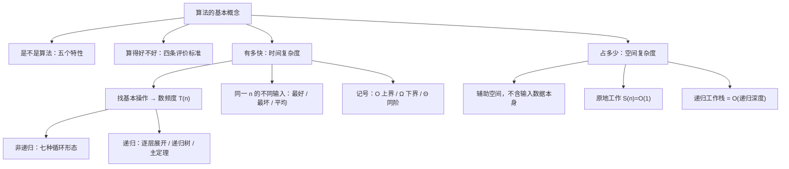

# 算法和算法评价

> 本文改写自 [CodeBrick 408 数据结构讲义 · 算法和算法评价](https://www.codebrick.tech/ds-blog/posts/intro/complexity)，原文链接保留。

> 2026 大纲 **一、基本概念（二）算法的基本概念**

本篇解决三个问题：什么算算法、什么是好算法、怎么衡量算法的快慢与省地。

## 1. 算法的定义与评价标准

### 符号约定

| 符号 | 含义 | 备注 |
|:---:|:---|:---|
| $n$ | 问题规模 | 输入数据的量级 |
| $T(n)$ | 时间复杂度函数 | 全部语句频度之和 |
| $S(n)$ | 空间复杂度函数 | 只统计**辅助存储空间** |
| $O$ | 渐近上界 | 存在 $c,n_0$ 使 $n\ge n_0$ 时 $T(n)\le c f(n)$ |
| $\Omega$ | 渐近下界 | $n\ge n_0$ 时 $T(n)\ge c\,g(n)$ |
| $\Theta$ | 同阶记号 | 同时是 $O$ 与 $\Omega$，具对称性 |
| 语句频度 | 一条语句的重复执行次数 | 基本操作的频度决定量级 |

---

### 五个特性

算法是**为解决某类问题而规定的有限长操作序列**。这个定义里的每个限定词都对应一条特性，五条缺一不可：

| 特性 | 含义 | 反例 |
|:---|:---|:---|
| **有穷性** | 有穷步内结束，每步也在有穷时间内完成 | `while(1) x++;`；操作系统主循环 |
| **确定性** | 每种情况的操作都有确切规定，无二义性 | 「把较大的放前面」——相等时没规定 |
| **可行性** | 都能由已实现的基本运算执行有限次完成 | 「取 $\pi$ 的全部小数位求和」 |
| **输入** | 零个或多个 | 打印九九乘法表没有输入，允许 |
| **输出** | 一个或多个 | 无输出的算法没有意义 |

::: warning 边界：算法必须有穷，程序不必
操作系统的等待循环是个正经程序，却永远不停，所以它**不是算法**（殷人昆 p24 明确点出这一条）。

另外：算法可以用自然语言或流程图描述，程序则必须用程序设计语言写成、能被执行。
:::

---

### 四条评价标准

「是不是算法」之外还有「好不好」：

| 标准 | 说明 |
|:---|:---|
| **正确性** | 能正确解决问题 |
| **可读性** | 便于阅读、理解、交流 |
| **健壮性** | 对非法输入能作出恰当反应 |
| **高效性** | 含时间与空间两面 |

::: tip 时间与空间的权衡
高效性的两面常常**此消彼长**，一般以**时间**为主要指标。本篇剩下的内容都在讲怎么衡量这两面。
:::

---

## 2. 怎么衡量快慢：只数基本操作

### 事后统计 vs 事前估算

| 方法 | 做法 | 缺陷 |
|:---|:---|:---|
| **事后统计** | 把程序跑一遍计时 | 必须先把算法实现出来；结果严重依赖机器和编译器 |
| **事前分析估算** | 不看时间，只数**执行次数** | 无（实际采用） |

---

### 只需数基本操作

不必把每条语句都数。一条语句的重复执行次数叫**语句频度**，$T(n)$ 是全部语句频度之和；但真正决定量级的只有**基本操作**——嵌套最深、次数最多的那条语句（查找类算法看关键字比较，排序类看比较与移动）。

::: tip 为什么数一条就够
剩下的部分只贡献**常数系数**和**低次项**，而大 $O$ 恰好把这两样丢掉。

$$\boxed{T(n) \text{ 的量级} = \text{基本操作的频度}}$$
:::

---

### 三个记号的分工

| 记号 / 规则 | 含义 |
|:---|:---|
| 大 $O$ | 存在 $c,n_0$ 使 $n\ge n_0$ 时 $T(n)\le c f(n)$，渐近**上界** |
| $\Omega$ | $n\ge n_0$ 时 $T(n)\ge c\,g(n)$，渐近**下界** |
| $\Theta$ | 同时是 $O$ 与 $\Omega$，上下界同阶，具有对称性 |
| **多项式规则** | $m$ 次多项式为 $O(n^m)$，低次项与全部系数丢掉 |
| **加法与乘法规则** | 并列取 $O(\max(f,g))$，嵌套取 $O(f\cdot g)$；与 $n$ 无关的常数记 $O(1)$ |
| **取最紧** | 上界不唯一，习惯取最紧的上界、最大的下界 |

---

### 常见量级

| 量级（递增） | 典型算法 | $10^9$ 次操作/秒、$n=10^6$ 时 |
|:---|:---|:---|
| $O(1)$ 常数阶 | 下标访问、散列查找（理想） | 瞬时 |
| $O(\log n)$ 对数阶 | 折半查找、二叉排序树查找 | 瞬时 |
| $O(n)$ 线性阶 | 顺序查找、遍历一遍表 | 1 ms |
| $O(n\log n)$ 线性对数阶 | 快排（平均）、归并、堆排序 | 20 ms |
| $O(n^2)$ 平方阶 | 直接插入、起泡、简单选择排序 | 约 17 分钟 |
| $O(n^3)$ 立方阶 | 三重循环（如 Floyd） | 约 32 年 |
| $O(2^n)$ 指数阶 | 穷举子集、汉诺塔 | 无法完成 |
| $O(n!)$ 阶乘阶 | 穷举排列 | 无法完成 |

::: warning 这张表只在 n 足够大时成立
渐近分析丢掉的常数在小规模下可能占主导：$n<1000$ 时 $n^2$ 反而比 $1000n$ 快。

快速排序在子表足够小时改用直接插入排序，依据就是这一条。
:::

---

### 全局脉络



::: info 看图要点
**非递归和递归是两套数法**——前者数循环转了几圈，后者要先写出递归方程。下面就分这两条走。

原文还有一张交互式概念图：[复杂度分析概念图](https://www.codebrick.tech/concept/overview/complexity-analysis)
:::

---

## 3. 数循环：看循环变量怎么长

### 核心原则

非递归算法的量级，全看**循环变量是怎么从起点走到终点的**：

- 每次**加一个常数** → 线性
- 每次**乘一个常数** → 对数
- 被**平方约束** → 平方根

---

### 七种循环形态

| 形态 | 代码骨架 | 精确次数 | 量级 |
|:---|:---|:---|:---|
| 1 单层线性 | `for(i=0;i<n;i++)` | $n$ | $O(n)$ |
| 2 嵌套独立 | 内层上界与外层无关 | $n\times m$ | $O(nm)$ |
| 3 嵌套相关 | `for(j=1;j<=i;j++)` 上界是外层变量 | $n(n+1)/2$ | $O(n^2)$ |
| 4 倍增 | `i=1; while(i<=n) i*=2;` | $\lfloor\log_2 n\rfloor+1$ | $O(\log n)$ |
| 5 折半 | `i=n; while(i>1) i/=2;` | $\lfloor\log_2 n\rfloor$ | $O(\log n)$ |
| 6 平方比较 | `for(i=0;i*i<=n;i++)` | $\lfloor\sqrt{n}\rfloor+1$ | $O(\sqrt{n})$ |
| 7 两段并列 | 两段顺序执行 | 相加 | 取较大者 |

---

### 频度计算示例

```c
int MatrixSum(int a[][N], int n) {
    int sum = 0;                      /* 频度 1 */
    for (int i = 0; i < n; i++)       /* 条件判断 n+1 次（最后一次为假才跳出）*/
        for (int j = 0; j < n; j++)   /* 对每个 i 判断 n+1 次，共 n(n+1) 次 */
            sum += a[i][j];           /* 频度 n²，这是基本操作 */
    return sum;                       /* 频度 1 */
}
```

$$\boxed{T(n) = 1 + (n+1) + n(n+1) + n^2 + 1 = 2n^2 + 2n + 3}$$

和基本操作的频度 $n^2$ **只差常数系数与低次项**——这就是「数最内层那一条就够」的由来。

::: warning 两处容易漏
- **循环的条件判断比循环体多一次**
- 内层判断是 $n(n+1)$ 而不是 $n^2$
:::

---

### 形态 4 与形态 5：量级相同，次数差一

两个形态量级相同，精确次数却差一次，这个差别值得单独看清楚。

| 形态 | 代码 | 次数推导 | $n=8$ 时 |
|:---|:---|:---|:---:|
| **形态 4（倍增）** | `i=1; while(i<=n) i*=2;` | 满足 $2^t\le n$ 的 $t\ (t\ge 0)$ 的个数 $= \lfloor\log_2 n\rfloor+1$ | **4** 次 |
| **形态 5（折半）** | `i=n; while(i>1) i/=2;` | 从 $n$ 折半到 $1$，$=\log_2 n$ | **3** 次 |

::: warning 这里不能写成 $\lceil\log_2 n\rceil$
取 $n=8$ 检验：形态 4 的 $i$ 依次取 $1,2,4,8$，执行 **4** 次，而 $\lceil\log_2 8\rceil=3$。

差别的来源是**边界**：形态 4 的循环体在 $i=1$ 时执行了一次（从 1 撑到 $n$），形态 5 在 $i=1$ 时不再执行（从 $n$ 缩到 1）。

**看循环体在边界值上执不执行**，就不会记混。
:::

---

### 嵌套循环不是一律相乘

::: warning 内层上界跟着外层变时不能相乘
**只有内层上界与外层无关时才是形态 2 的相乘**。

内层上界或步长跟着外层变（如 `for (j = 1; j <= n; j += i)`），次数由**起点、终点、步长**共同决定，得老老实实求和——那种情形总次数是 $\Theta(n\log n)$，不是 $O(n^2)$。
:::

---

## 4. 数递归：写方程再逐层展开

### 方法

递归没有循环变量可数，得先把代价写成**递归方程**（递归项 + 非递归项 + 边界条件），再**逐层展开**：反复代入自身直到看出规律，用边界条件收尾。

---

### 常见递归方程

| 递归式 | 解 | 典型来源 |
|:---|:---|:---|
| $T(n)=T(n-1)+1$ | $\Theta(n)$ | 阶乘、单链表递归遍历 |
| $T(n)=T(n-1)+n$ | $\Theta(n^2)$ | 每层还要扫一遍整表 |
| $T(n)=T(n/2)+1$ | $\Theta(\log n)$ | 折半查找（只进一个子区间） |
| $T(n)=2T(n-1)+1$ | $\Theta(2^n)$ | 汉诺塔，精确解 $2^n-1$ |
| $T(n)=2T(n/2)+n$ | $\Theta(n\log n)$ | 归并排序 |

这张表的每一行都是展开出来的，不必背。

---

### 规模每次减 1：以阶乘为例

```c
long long Fact(int n) {
    if (n <= 1) return 1;          /* 递归出口 */
    return n * Fact(n - 1);        /* 问题规模每次减 1 */
}
```

`Fact` 每层只做常数次操作，对应 $T(n)=T(n-1)+1$，展开得 $\Theta(n)$。

若每层的代价换成 $n$（比如每层还要扫一遍整表），就是 $T(n)=T(n-1)+n$：

$$\boxed{ T(n) = T(n-1) + n = \frac{n(n+1)}{2} = \Theta(n^2) }$$

---

### 规模每次减半：以折半查找为例

```c
/* 在升序数组 a[low..high] 中折半查找 key，找到返回下标，找不到返回 -1 */
int BinSearch(int a[], int low, int high, int key) {
    if (low > high) return -1;             /* 出口：区间为空，查找失败 */
    int mid = low + (high - low) / 2;      /* 这样写而非 (low+high)/2，避免相加溢出 */
    if (a[mid] == key) return mid;
    else if (a[mid] > key)
        return BinSearch(a, low, mid - 1, key);   /* key 更小，只进入左半区间 */
    else
        return BinSearch(a, mid + 1, high, key);  /* key 更大，只进入右半区间 */
}
```

$$T(n) = T\!\left(\frac n2\right) + 1 = T\!\left(\frac n4\right) + 2 = \dots = T\!\left(\frac{n}{2^k}\right) + k$$

令 $\dfrac{n}{2^k}=1$ 得 $k=\log_2 n$，代回得：

$$\boxed{T(n)=1+\log_2 n=\Theta(\log n)}$$

---

### 规模派生两个子问题：汉诺塔

每层派生**两个**子问题、规模只减 1。把 $n$ 个盘从 A 移到 C：先把上面 $n-1$ 个借 C 移到 B，再把第 $n$ 号移到 C，最后把 B 上的 $n-1$ 个借 A 移到 C。

$$T(n) = 2T(n-1)+1 = \dots = 2^{k}T(n-k) + (2^{k}-1)$$

令 $k=n-1$ 得：

$$\boxed{T(n)=2^{n}-1=\Theta(2^n)}$$

取 $n=1,2,3,4$ 检验，移动次数 $1,3,7,15$ 逐个吻合。

::: warning 减 1 和减半是两回事
前者线性、后者对数。**递归本身不带来任何量级**，量级来自规模缩小的方式。
:::

---

### 递归树与主定理

::: details 递归树：把每层代价摊在树上逐层求和
适合 $T(n)=aT(n/b)+f(n)$。以归并排序的 $T(n)=2T(n/2)+n$ 为例：

第 $i$ 层（根为第 0 层）有 $2^i$ 个子问题、每个规模 $n/2^i$、每个的非递归代价 $n/2^i$，故该层总代价 $=2^i\times n/2^i=n$，**与层号无关**；规模从 $n$ 折半到 1 共 $\log_2 n+1$ 层，总代价 $=\Theta(n\log n)$。

「每层 $O(n)$、共 $O(\log n)$ 层，故 $O(n\log n)$」——这句话就是递归树法的完整推导，归并排序、快速排序的复杂度都是这么来的，不必当结论背。
:::

::: details 主定理：比 n^log_b a 与 f(n) 谁大
对 $T(n)=a\,T(n/b)+f(n)$（$a\ge1,\ b>1$），记 $d=\log_b a$：

| 情形 | 条件 | 结论 |
|:---:|:---|:---|
| 1 | 存在 $\varepsilon>0$ 使 $f(n)=O(n^{d-\varepsilon})$ | $T(n)=\Theta(n^{d})$ |
| 2 | $f(n)=\Theta(n^{d})$ | $T(n)=\Theta(n^{d}\log n)$ |
| 3 | 存在 $\varepsilon>0$ 使 $f(n)=\Omega(n^{d+\varepsilon})$ 且 $c<1$ 使 $a\,f(n/b)\le c\,f(n)$ | $T(n)=\Theta(f(n))$ |

**一句话用法**：算出 $n^{\log_b a}$ 跟 $f(n)$ 比谁大，**大的赢**；一样大就再乘一个 $\log n$。

| 递归式 | $n^{\log_b a}$ | $f(n)$ | 结论 | 出现在 |
|:---|:---:|:---:|:---|:---|
| $T(n)=T(n/2)+O(1)$ | $1$ | $1$ | $\Theta(\log n)$ | 折半查找 |
| $T(n)=2T(n/2)+O(1)$ | $n$ | $1$ | $\Theta(n)$ | 二叉树遍历、求结点数 |
| $T(n)=2T(n/2)+O(n)$ | $n$ | $n$ | $\Theta(n\log n)$ | 归并排序、快排平均情形 |
| $T(n)=2T(n/2)+O(n^2)$ | $n$ | $n^2$ | $\Theta(n^2)$ | —— |

::: warning 主定理的适用条件
主定理只适用于**规模按倍数缩小**的 $T(n)=aT(n/b)+f(n)$。

对**规模按常数递减**的 $T(n)=T(n-1)+f(n)$、$T(n)=2T(n-1)+f(n)$，主定理**不适用**，只能逐层展开——这正是逐层展开必须掌握、不能只背主定理的原因。
:::

::: info 二叉树遍历那一行的限定
$T(n)=2T(n/2)+O(1)$ 描述的是**平衡**二叉树。

一般的二叉树应写成 $T(n)=T(k)+T(n-1-k)+O(1)$（左子树 $k$ 个结点、右子树 $n-1-k$ 个结点）；不论 $k$ 取什么，展开后每个结点恰好被访问一次，总代价都是 $\Theta(n)$——结论不变，但推导过程不同。
:::
:::

---

## 5. 最好、最坏与平均

同一个 $n$，喂进去的数据不同，执行次数也可能差很远。于是同一个算法有三档：

| 情况 | 定义 | 说明 |
|:---|:---|:---|
| **最好** | 计算量的最小值 | 易求，但出现概率通常极小 |
| **最坏** | 计算量的最大值 | 上界保证，**默认讨论的就是它** |
| **平均** | 各输入等概率时计算量的加权平均值 | 最贴近实际，但常难以确定 |

::: warning 三档比较的是同一 n 下的不同输入
别和大 $O$ 混作一谈。$O$ 描述的是函数关系（渐近上界），最好/最坏是在**挑输入**，两者正交。

「最坏情况下的时间复杂度是 $O(n^2)$」和「平均情况下是 $O(n)$」可以同时成立。直接插入排序遇升序是最好 $O(n)$、遇逆序是最坏 $O(n^2)$，变的是初始状态。
:::

### 平均情况永远附带概率分布假设

题目不说明时默认等概率，一旦给了别的分布就必须按给定分布重算。

例如已知待查元素有 $50\%$ 的概率就在第 1 个位置、其余 $n-1$ 个位置均分剩下的 $50\%$：

$$\boxed{ 0.5\times 1 + \sum_{i=2}^{n}\frac{0.5}{n-1}\times i = 0.5 + \frac{n+2}{4} }$$

取 $n=4$ 核对：等概率时是 $\dfrac{4+1}{2}=2.5$ 次，按上式是 $2.0$ 次；$n=10$ 时分别是 $5.5$ 与 $3.5$ 次。**量级仍是 $O(n)$，变的只是常数。**

::: tip 默认约定
由于平均情况往往难以确定，**除非特别指明，讨论的时间复杂度一律指最坏情况**。

后面各章沿用这个约定，只在排序一章同时给出三档。
:::

---

## 6. 空间复杂度

### 只度量辅助存储空间

$S(n)$ 只度量**辅助存储空间**：

| 项目 | 是否计入 |
|:---|:---:|
| 程序本身、常数 | 否 |
| **输入数据本身** | 否（占多大取决于问题，与算法无关） |
| 额外申请的变量、数组 | **是** |
| **递归工作栈** | **是** |

| $S(n)$ | 含义 | 例子 |
|:---|:---|:---|
| $O(1)$ | 原地工作，只用常数个额外变量 | 起泡、直接插入、简单选择、堆排序 |
| $O(\log n)$ | 递归深度为 $\log n$ | 折半查找（递归）、快排（平均） |
| $O(n)$ | 与输入同量级的辅助空间 | 归并排序的辅助数组、快排最坏的递归栈 |

---

### 核心结论

::: tip 一句话记住
**时间数的是递归树的结点总数，空间数的是递归树的高度。**
:::

递归是深度优先展开的，左分支出栈后右分支才入栈，所以栈上任何时刻只躺着「根到叶」的一条路径——每层只占常数空间时，$S(n)$ 就等于递归工作栈的**最大深度**，而不是调用总次数。

两段只差「进一个子区间」还是「进两个子区间」的代码，正好把这件事分开：

| 情形 | 递归式 | 时间 | 同时在栈的层数 | 空间 |
|:---|:---|:---:|:---|:---:|
| 只递归一边（折半查找） | $T(n)=T(n/2)+O(1)$ | $O(\log n)$ | 根到叶一条路径 | $O(\log n)$ |
| 两边都递归（统计出现次数） | $T(n)=2T(n/2)+O(1)$ | $O(n)$ | 仍是根到叶一条路径 | $O(\log n)$ |

---

### 典型情形汇总

| 算法 | 递归深度 | 其他辅助空间 | 空间复杂度 | 深度为什么是这个值 |
|:---|:---:|:---:|:---|:---|
| 阶乘 / 单链表递归遍历 | $n$ | $O(1)$ | $O(n)$ | 规模每次只减 1 |
| 折半查找（递归） | $\lfloor\log_2 n\rfloor+1$ | $O(1)$ | $O(\log n)$ | 规模每次减半 |
| 汉诺塔 | $n$ | $O(1)$ | $O(n)$ | 时间虽是 $O(2^n)$，栈上仍只有一条路径 |
| 二叉树先序遍历（递归） | 树高 $h$ | $O(1)$ | 最坏 $O(n)$、平衡时 $O(\log n)$ | 深度就是树高；单支树时 $h=n$ |
| 归并排序 | $O(\log n)$ | 辅助数组 $O(n)$ | $O(n)$ | 两项取较大者 |
| 快速排序 | 平均 $O(\log n)$、最坏 $O(n)$ | $O(1)$ | 平均 $O(\log n)$、最坏 $O(n)$ | 划分越均匀树越矮；每次切成 0 和 $n-1$ 时退化成链 |

---

### 原地与非原地对照

::: details 写大题时会用上的两组细节
**第一组：时间同为 $O(n)$，空间一个 $O(1)$ 一个 $O(n)$**

```c
/* 原地逆置：S(n) = O(1)，全程只用了 i、j、t 三个额外变量 */
void Reverse(int a[], int n) {
    int i = 0, j = n - 1, t;
    while (i < j) {                     /* i == j 时中间那个元素不用换，直接停 */
        t = a[i]; a[i] = a[j]; a[j] = t;
        i++; j--;
    }
}

/* 借助辅助数组逆置：S(n) = O(n)，多开了一个长度为 n 的数组 */
void ReverseCopy(int a[], int n) {
    int *b = (int *)malloc(sizeof(int) * n);
    for (int i = 0; i < n; i++) b[i] = a[n - 1 - i];
    for (int i = 0; i < n; i++) a[i] = b[i];
    free(b);                            /* 申请了就要释放 */
}
```

**第二组：形参占不占空间**

C 语言里数组作形参会**退化成指针**，`void f(int a[], int n)` 与 `void f(int *a, int n)` 完全等价，传的是首地址、不产生数组拷贝，只占 $O(1)$。

但**结构体按值传入会真的拷贝**：把含 `MaxSize` 数组成员的 `SqList L` 按值传给递归函数，每层都复制一整份，空间会从 $O(\text{深度})$ 变成 $O(\text{深度}\times\text{结构体大小})$。写成 `SqList *L` 或 `SqList &L` 就不会。
:::

---

## 7. 考点速记

### 三条核心结论

::: tip 会被反复调用
1. **分析的是基本操作的执行次数，不是运行时间**——大 $O$ 丢掉系数与低次项
2. **递归的时间与空间量级可以差很远**——时间数递归树的结点总数，空间数递归树的高度
3. **主定理只管「规模按倍数缩小」的递归式**，$T(n)=T(n-1)+f(n)$ 一律逐层展开
:::

---

### 真题考法

这一节在真题里的考法是同一道题的变体——**给一段程序片段，问它的时间复杂度**。区别只在循环变量的走法，所以判断顺序固定：**先看循环变量每次怎么变，再看有没有嵌套、内层依不依赖外层。**

| 特征 | 量级 |
|:---|:---|
| 每次乘 2（或除以 2） | $\log$ 级。`x = 2 * x` 从 2 撑到 $n/2$，约 $\log_2 n$ 次 |
| 每次加 1，但被平方约束 | $\sqrt{n}$ 级。`i*i < n` 等价于 $i<\sqrt n$ |
| 每次加的量本身在变 | 先求和再判。`sum += ++i` 直到 `sum >= n`，累加 $1+2+\dots+i$，解出 $i\approx\sqrt{2n}$ |
| 嵌套且内层与外层无关 | 两层相乘。外层 `k *= 2` 走 $\log_2 n$ 次、内层 $n$ 次，合起来 $O(n\log n)$ |
| 嵌套且内层上界就是外层变量 | 不能相乘，要求和。外层 `i *= 2`、内层 `j < i`，总次数 $1+2+4+\dots\approx n$，是 $O(n)$ 而非 $O(n\log n)$ |
| 递归 | 只看规模怎么缩。`fact(n-1)` 是减 1，深度 $n$，$O(n)$ |

---

### 四个易错点

::: warning 易错一：嵌套循环里只看了一层
只盯外层 `k *= 2` 就答 $O(\log n)$、只盯内层 `j<n` 就答 $O(n)$，都是漏掉了另一层的乘法。

看到嵌套，先确认内层跑几次、外层跑几次，再决定是相乘还是求和。
:::

::: warning 易错二：「内层依赖外层」被当成了相乘
外层 $\log_2 n$ 层、内层 $j<i$ 时，每层的次数不一样，得按等比数列求和，答案是 $O(n)$；直接乘成 $O(n\log n)$ 就错了。

同理，内层 `j<i` 配上外层 $\sqrt n$ 次时，总数是 $O(n)$。
:::

::: warning 易错三：把「递归」和「对数」画等号
$O(\log n)$ 对应的是**规模每次减半**（如折半查找），而 `fact(n) = n * fact(n-1)` 每次只减 1，深度是 $n$，时间是 $O(n)$。
:::

::: warning 易错四：开方当成了取对数
`i*i < n` 是 $O(\sqrt n)$，不是 $O(\log n)$；只有乘除以常数才是对数级。
:::

---

### 教材出处

::: details 对照教材页码（严蔚敏《数据结构（C 语言版）》第 2 版 / 殷人昆《数据结构——用面向对象方法与 C++ 描述》第 2 版）
- **严 p11**：算法定义与五个特性、评价四条标准（正确性、可读性、健壮性、高效性）
- **严 p12**：语句频度、基本语句的定义；矩阵乘法的逐句频度统计
- **严 p13**：大 $O$ 定义；定理 1.1（$m$ 次多项式为 $O(n^m)$）
- **严 p13~14**：常见时间复杂度按数量级递增的排列
- **严 p15**：最好/最坏/平均时间复杂度定义；顺序查找等概率下平均频度 $n/2$ 的推导；「除特别指明外均指最坏情况」的约定
- **严 p15~16**：空间复杂度定义（只统计辅助存储空间）；时间与空间「此消彼长」
- **严 p65~67**：递归工作栈与活动记录的进栈/退栈过程；汉诺塔递归解法
- **殷 p24**：算法与程序的界线（程序可以不满足有穷性）
- **殷 p33~34**：大 $O$ 一般提法、加法规则、量级序列 $c<\log_2 n<n<n\log_2 n<n^2<n^3<2^n<3^n<n!$
- **殷 p35**：乘法规则、渐近空间复杂度定义
- **殷 p36~37**：$\Omega$ 与 $\Theta$ 记号定义、顺序搜索三档分析

> 主定理不在上述两本教材的正文中，本篇把它作为**求解 $T(n)=aT(n/b)+f(n)$ 的工具**给出，并同时给出逐层展开法——后者才是两本教材共同采用的方法，也是减法型递归式唯一可用的方法。
:::

---

> 本文改写自 CodeBrick 408 数据结构讲义：[算法和算法评价](https://www.codebrick.tech/ds-blog/posts/intro/complexity)
