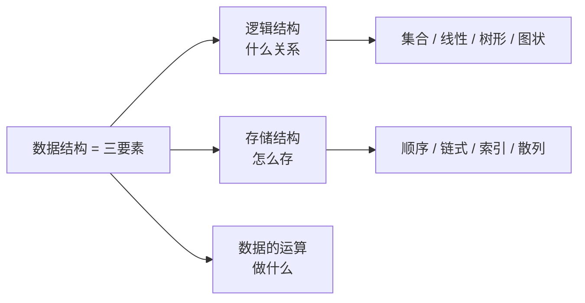

# 数据结构的基本概念

> 本文改写自 [CodeBrick 408 数据结构讲义 · 数据结构的基本概念](https://www.codebrick.tech/ds-blog/posts/intro/concepts)，原文链接保留。

## 0. 这一节在问什么

三个我一开始没想清楚的问题：

1. 一堆数据摆在那里，**光有值够用吗**？为什么还要讲「结构」？
2. 栈、队列、数组看起来完全不同的东西，**凭什么都算「线性结构」**？
3. 「有序表」和「顺序表」看着差不多，**差别到底在哪一层**？

这一节不给具体算法，只给**判断依据**——后面每一章都会回来用它。

---

## 1. 三要素：缺一个就说不完整

### 为什么必须有三个

假设手里有一批学生记录。它们之间是「互不相干的一群」、「排成一队」、还是「分成上下级」？这直接决定了**你能做什么、做得多快**。

所以要回答三件事：

| 要素 | 回答的问题 |
|:---|:---|
| **逻辑结构** | 元素之间**是什么关系** |
| **存储结构** | 这些关系**怎么落到内存里** |
| **数据的运算** | 在这个前提下**能做什么、怎么做** |

---

### 关键：依赖是单向的

::: warning 这句话考试喜欢抠
**逻辑结构独立于存储结构**——同一种逻辑关系，顺序存、链式存都行。

**存储结构不能独立于逻辑结构**——你得先知道要表达什么关系，才谈得上怎么表达。

单向依赖，反过来不成立。
:::

::: tip 一个能直接用的推论
「普通二叉树」和「二叉排序树」可以有**完全相同的逻辑结构和存储结构**——把它们分开的只有**运算的定义**。

三要素缺一不可，这句话就是这么兑现的。
:::

---

## 2. 逻辑结构：只有四类，怎么分

### 分类依据只有一条

**数一数每个元素的直接前驱和直接后继各有几个。**

| 逻辑结构 | 直接前驱 | 直接后继 | 关系 | 例子 |
|:---|:---:|:---:|:---:|:---|
| 集合 | 无前后驱概念 | — | 仅同属一个集合 | 判断某学生是否在本班 |
| **线性结构** | 至多 1 个 | 至多 1 个 | 一对一 | 线性表、栈、队列、串、数组 |
| **树形结构** | 至多 1 个（双亲） | 可有多个（孩子） | 一对多 | 二叉树、文件目录 |
| **图状结构** | 可有多个 | 可有多个 | 多对多 | 交通网、社交网 |

::: tip 为什么恰好是四类
前驱与后继的个数各取「至多 1 个 / 可有多个」两档，组合出三种有意义的情形，再加上根本没有前后驱关系的集合。
:::

---

### 归类易错：这几个都是线性结构

::: warning 别被「看起来不像」骗了
- **栈和队列是线性结构**。它们是「操作受限的线性表」——受限的是**运算**，不是元素之间的关系
- **串是线性结构**，特殊之处只在于数据元素只能是一个字符
- **数组是线性结构**。二维数组不是「非线性」——「维」说的是**下标个数**，不是元素间关系的复杂度
- **广义表**也是线性表的推广，与数组的区别在于元素**不同构**（可以是单个元素，也可以是子表）
:::

---

## 3. 存储结构：四种方法的真正分界

### 分界线在哪

存的时候有两样东西要落地：**每个元素的值**，以及**元素之间的逻辑关系**。

后半句才是四种存储方法真正的分界线——**它们的区别就是「用什么手段表达关系」**。

| 存储方法 | 关系靠什么表达 | 存取方式 | 主要代价 |
|:---|:---|:---|:---|
| **顺序存储** | 存储单元的**邻接位置** | 随机存取 | 需连续空间；插删要移动大量元素 |
| **链式存储** | 附加的**指针** | 只能顺序存取 | 指针占空间；按位序访问 $O(n)$ |
| **索引存储** | 附加的**索引表** | 先查索引表再定位 | 索引表占空间；插删要维护索引 |
| **散列存储** | 关键字与地址间的**函数** | 直接定址 | 必然出现冲突，须设计冲突处理 |

---

### 两个要被追问的点

**顺序存储的地址是算出来的**：

$$\boxed{\text{Loc}(a_i)=\text{Loc}(a_1)+(i-1)\times L}$$

（$L$ 为每个元素占用的存储单元数）所以支持随机存取。

**链式存储引出存储密度**：

$$\boxed{\text{存储密度} = \frac{\text{结点中数据本身占用的存储量}}{\text{结点占用的存储总量}}}$$

::: warning 「链式更省空间」这句话要说清楚
顺序存储的存储密度为 1，链式恒小于 1。

所以「链式更省空间」省的是**预先分配却没用上的空闲空间**，不是每个结点的空间——**论单个结点，链式反而更费**。
:::

::: info 索引 vs 散列：查表还是算式
- **索引存储**要**查一张表**（索引项一般是 $(	ext{关键字},\ 	ext{地址})$），按密度分**稠密索引**（每个结点一个索引项）和**稀疏索引**（一组结点共用一个索引项，地址指向组起始位置，找到组还要组内顺序找）
- **散列存储算一个式子**，不需要表；代价是函数不可能是单射，必然冲突
:::

---

### 四种方法可以组合

::: tip 「某某结构用的是哪种存储」答案可以不止一个
- **邻接表** = 顶点表顺序存储 + 边表链式存储
- **索引顺序表**（分块查找）= 索引表 + 各块内部顺序存储
- **拉链法散列表** = 散列存储定位到桶 + 桶内链式存储
:::

---

## 4. 运算：为什么换个存法效率就变

运算有两面：**定义**面向逻辑结构说**做什么**；**实现**面向存储结构说**怎么做**。

同一个逻辑结构换一种存储，同一个运算的效率会成对地此消彼长：

| 运算 | 顺序存储 | 链式存储 | 差别的来源 |
|:---|:---:|:---:|:---|
| 按位序取第 $i$ 个 | $O(1)$ | $O(n)$ | 顺序存储地址能直接算；链式只能从头走 |
| 按值查找 | $O(n)$ | $O(n)$ | 两者都要逐个比较 |
| 在第 $i$ 个位置插入 | $O(n)$ | 已知前驱时 $O(1)$ | 顺序要整体后移；链式只改两个指针 |
| 删除第 $i$ 个元素 | $O(n)$ | 已知前驱时 $O(1)$ | 同上，方向相反 |

::: warning 限定语被吃掉是最大的坑
链式那两个 $O(1)$ 带着「**已知前驱结点时**」。

如果题目只给位序 $i$，你还得先花 $O(n)$ 走到第 $i-1$ 个结点，总代价**仍是 $O(n)$**。

这张表用错，多半就是因为这个限定语被吃掉了。
:::

---

## 5. ADT：为什么它不含存储结构

### 定义

**抽象数据类型（ADT）** = 用户定义的数学模型 + 定义在其上的一组操作，包含三部分：

- 数据对象 $D$
- 关系的集合 $S$（即逻辑结构）
- 基本操作的集合 $P$（即运算的定义）

核心是**信息隐藏**：使用者只需知道能做什么、初始条件、结果，不需要知道怎么存、怎么实现。

---

### 三方对比：边界一次看清

| | 值集 | 逻辑结构 | 运算定义 | 存储结构 | 运算实现 |
|:---|:---:|:---:|:---:|:---:|:---:|
| **数据类型** | 语言预定义 | 隐含 | 语言预定义 | 语言决定 | 语言决定 |
| **抽象数据类型** | 用户定义 | 用户定义 | 用户定义 | **不含** | **不含** |
| **数据结构** | 有 | 有 | 有 | 有 | 有 |

::: tip 一句话
**ADT = 逻辑结构 + 运算的定义**，不含存储结构与实现。

数据类型与 ADT 的差别在于**谁来定义**。
:::

---

## 6. 一个万能判断题

这一节最实用的东西是一条可以直接套的方法：

::: tip 换一种存储方式，这句话还成立吗？
- **成立** → 属于**逻辑层**
- **不成立** → 属于**存储层**
:::

| 名词 | 判断过程 | 结论 |
|:---|:---|:---|
| 有序表 | 「按关键字非递减排列」顺序存、链式存都成立 | **逻辑结构** |
| 顺序表 | 「顺序」就是指顺序存储方法 | **存储结构** |
| 链表 | 「用指针表示逻辑关系」本身就是存储方法 | **存储结构** |
| 哈希表 | 「由关键字算地址」就是散列存储方法 | **存储结构** |
| 栈、队列 | 「只能在一端进出」限制的是**运算** | **逻辑结构** |
| 循环队列 | 「用数组首尾相接实现队列」是顺序实现 | **存储结构** |
| 二叉排序树 | 「左小右大」与怎么存无关 | **逻辑结构** |

---

## 7. 易错清单

::: warning 易错一：有序表 vs 顺序表
「有序」修饰的是**关系**，「顺序」修饰的是**存储方法**——两个词不在同一层。

所以：**有序表可以用链表实现，顺序表也可以是无序的**。
:::

::: warning 易错二：顺序存储 vs 顺序存取
一个说「怎么放」，一个说「怎么取」，而且结论正好**反直觉**：

- **顺序存储**支持的是**随机存取**（严蔚敏 p23）
- **顺序存取**指必须从头逐个走，那是**链式**的性质
:::

::: warning 易错三：数据元素是「基本单位」，不是「最小单位」
最小单位是**数据项**。这两个词换一个字，结论就反了。

另外「同一数据对象中所有元素具有相同特性」是对的，但「相同特性」指**所含数据项个数相同、对应类型一致**，不是值相同。
:::

---

## 8. 速记

::: tip 三条会被反复调用的结论
1. **三要素缺一不可**——普通二叉树与二叉排序树可以有完全相同的逻辑结构和存储结构，区分它们的只有**运算的定义**
2. **逻辑结构独立于存储结构，存储结构不能独立于逻辑结构**——单向依赖
3. **ADT 只有逻辑结构和运算的定义**，不含存储结构与实现
:::

**这一节不单独成题**，它给出的是判断依据，兑现的地方在后面每一章——判断某个名词属于逻辑层还是存储层、某个复杂度差别的来源是存储方法还是运算定义、某种结构能不能换一种存法。

所以这一节**不用背，要能用**。

---

> 本文改写自 CodeBrick 408 数据结构讲义：[数据结构的基本概念](https://www.codebrick.tech/ds-blog/posts/intro/concepts)
