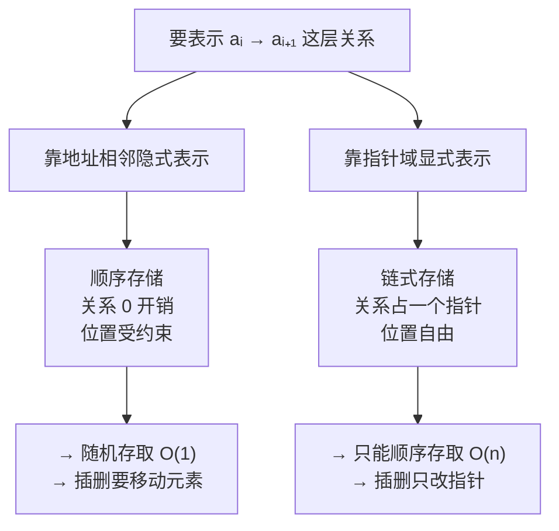

# 线性表的定义与基本概念

> 本文改写自 [CodeBrick 408 数据结构讲义 · 线性表的定义与基本概念](https://www.codebrick.tech/ds-blog/posts/linear/concepts)，原文链接保留。

## 0. 这一节在问什么

三个问题：

1. 为什么「线性表」一定要分成**逻辑结构**和**存储结构**两层？
2. 顺序表和链表的那么多差异，**能不能只记一个源头**？
3. 「链表插删 $O(1)$」这句话，**为什么是错的**？

这一节的结论不在本篇兑现，而是后面每一篇（顺序表、单链表、双链表）都要回来用它。

---

## 1. 线性表的定义：三个限定词

线性表是由 $n\ (n\ge 0)$ 个**数据特性相同**的元素构成的**有限序列**，记作 $L=(a_1,a_2,\dots,a_n)$。$n$ 叫表长，$n=0$ 时是空表。

三个限定词缺一不可：

| 判断标准 | 含义 | 反例 |
|:---|:---|:---|
| **数据特性相同** | 所有元素属于同一数据对象，占用相同大小的存储空间 | 一个数组里既放 `int` 又放结构体 |
| **有限** | 元素个数 $n$ 是有限的 | 无穷序列 |
| **序列** | 元素之间有确定的先后次序 | 集合无序 |

### 为什么「序列」最要紧

::: tip 这一条决定了后面所有操作的合法性
「序列」意味着元素之间的关系由**位置**决定，而不是由值决定。

$(3,1,2)$ 和 $(1,2,3)$ 是**同一个集合**，但**不是**同一个线性表。

「按位查找」「在第 $i$ 个位置插入」这些操作之所以说得通，全靠这一条。
:::

### 四条特征 = 一对一的精确表述

非空线性表的四条特征：有唯一的「第一个」（无前驱）、唯一的「最后一个」（无后继）、其余元素**有且仅有一个**直接前驱、**有且仅有一个**直接后继。

这四条合起来正是「**一对一**」的精确表述，也是线性结构与树（一对多）、图（多对多）的分界线。

::: warning 前驱 ≠ 直接前驱
$a_1$ 到 $a_{i-1}$ **全都是** $a_i$ 的前驱，而直接前驱只有 $a_{i-1}$ 一个。

链表结点的指针域存的是**直接**后继——这个「直接」是后面所有指针操作的前提。
:::

---

## 2. 为什么要分两层

| 层 | 回答的问题 | 面向 |
|:---|:---|:---|
| **逻辑结构** | 数据元素之间有什么关系 | 问题，与计算机无关 |
| **存储结构** | 这些关系在内存里怎么表示 | 机器 |

### 分层的价值：一个例子说清

线性表的逻辑结构要求「能取到第 $i$ 个元素」，顺序表和链表**都必须兑现**这个承诺；但顺序表兑现它只要 $O(1)$，链表要 $O(n)$。

::: tip 一句话记住分层
**「能不能做」是逻辑结构的事，「要花多少代价」是存储结构的事。**
:::

### 不分层就会冒出三种错说法

| 混淆的说法 | 为什么错 | 正确表述 |
|:---|:---|:---|
| 「线性表是用数组实现的」 | 把逻辑结构和它的一种实现绑死了 | 线性表**可以**用顺序存储实现，**也可以**用链式存储实现 |
| 「链表不是线性表」 | 用存储结构否定逻辑结构 | 链表是线性表的一种**存储结构**，逻辑结构仍是线性表 |
| 「顺序存储的一定能随机存取」 | 把两个不同层面的「顺序」混为一谈 | 顺序表是顺序**存储**且支持随机**存取**；两个「顺序」毫无关系 |

---

## 3. 一个分叉推出全部差异

到了存储层，「$a_i$ 的直接后继是 $a_{i+1}$」这层关系只有两种表示办法——这是整章唯一需要记的分叉：

两条路的代价正好对读：

| 路径 | 关系开销 | 位置约束 | 结果 |
|:---|:---|:---|:---|
| 靠**地址相邻**隐式表示 | 0 | 元素必须「排队站好」 | 随机存取；插删要全体后移 |
| 靠**指针**显式表示 | 一个指针域 | 元素可散落 | 插删只改指针；只能顺序存取 |

::: tip 下面所有对比表都能反推回这个分叉
不需要分别背两张表。
:::

### 顺序表 vs 链表

| 比较维度 | 顺序表 | 链表 | 差异的来历 |
|:---|:---|:---|:---|
| 存取方式 | **随机存取** $O(1)$ | **顺序存取** $O(n)$ | 地址由公式算出 vs 必须顺链走 |
| 按位查找 | $O(1)$ | $O(n)$ | 同上 |
| 按值查找 | $O(n)$ | $O(n)$ | 两者都要逐个比较 |
| 插入 / 删除 | $O(n)$，平均移动约半个表 | 改指针 $O(1)$，但**定位前驱** $O(n)$ | 逻辑相邻是否绑定物理相邻 |
| 空间分配 | 预先分配，需估上限 | 按需申请 | 是否要求整块连续空间 |
| 存储密度 | $1$ | $< 1$ | 链表每结点多一个指针域 |

### 存储密度

$$\boxed{\text{存储密度} = \frac{\text{元素本身占用}}{\text{整个结点占用}}}$$

顺序表恒为 1；存 `int` 的单链表，数据域 4 字节、指针域 4 字节，密度只有 **0.5**。

但这个数会随数据域变大而迅速接近 1——数据域 100 字节时约 **0.96**。

::: warning 「链表比顺序表费空间」是站不住的笼统结论
数据域越大，指针的相对开销越小。

而表长难以预估时，顺序表按上限预分配造成的**空闲区浪费**，往往远超链表的指针开销。
:::

### 怎么选

| 应用特征 | 选择 | 理由 |
|:---|:---|:---|
| 表长变化大、事先难估规模 | **链表** | 顺序表要么溢出，要么预分配造成浪费 |
| 表长稳定、容易确定 | **顺序表** | 存储密度为 1，不必付指针开销 |
| 主要按位序取值，很少增删 | **顺序表** | 随机存取 $O(1)$ 是链表给不了的 |
| 频繁在表中间插入、删除 | **链表** | 不必移动元素（注意下方易错一） |

---

## 4. ADT 与三点约定

| 操作 | 含义 | 前置条件 |
|:---|:---|:---|
| `InitList(&L)` | 构造空表 | 无 |
| `DestroyList(&L)` | 销毁表，释放空间 | $L$ 已存在 |
| `ClearList(&L)` | 重置为空表（结构还在） | $L$ 已存在 |
| `ListLength(L)` | 返回表长 $n$ | $L$ 已存在 |
| `GetElem(L, i, &e)` | **按位查找** | $1\le i\le n$ |
| `LocateElem(L, e)` | **按值查找** | $L$ 已存在 |
| `ListInsert(&L, i, e)` | 在第 $i$ 个位置**之前**插入 | $1\le i\le n+1$ |
| `ListDelete(&L, i)` | 删除第 $i$ 个元素 | $1\le i\le n$ |
| `TraverseList(L)` | 遍历 | $L$ 已存在 |

::: info 这些操作是怎么挑出来的
标准是「**是否只能由结构的实现者完成**」。

求最大值、判有序、合并两个表，都能用上面的基本操作**组合**出来，所以不进清单；而插入、删除要直接操纵存储结构（移动元素或改指针），使用者拼不出来，必须进清单。
:::

### 三点必须说清的约定

::: warning 位序从 1 开始
第 1 个元素的位序是 **1**，不是 0。

而顺序表底层数组下标从 0 开始，所以第 $i$ 个元素存在 `data[i-1]`——这个「错位 1」是顺序表代码里**最容易写反的地方**。
:::

::: warning 插入和删除的合法范围不同
- **插入**：$1 \le i \le n+1$
- **删除**：$1 \le i \le n$

插入多出的那个 $n+1$，对应「插在表尾之后」，此时**不需要移动任何元素**。
:::

**`&` 的含义**：表示该参数会被操作修改（C++ 引用传参）。凡是可能改变表本身（表长、首地址、头指针）的操作都带 `&`，只读操作不带。

---

## 5. 易错清单

::: warning 易错一：「链表插删 O(1)」必须带上前提
前提是「**已知前驱指针**」。

只给位序 $i$ 时，得先花 $O(n)$ 走到第 $i-1$ 个结点，总代价**仍是 $O(n)$**。

链表真正占便宜的场景是「**边遍历边增删**」——遍历已经把前驱送到手里了。
:::

::: warning 易错二：「顺序存储」和「顺序存取」是两个层面的词
顺序**存储**（顺序表）支持的恰恰是**随机存取**；顺序**存取**指的是必须从头逐个走，那是**链表**的性质。

两个词长得像，结论正好相反。
:::

::: warning 易错三：别用存储结构去否定逻辑结构
链表是线性表，**栈和队列也是线性表**——它们受限的是**运算**，不是元素之间的关系。
:::

---

## 6. 速记

::: tip 三条会被反复调用
1. **逻辑结构决定能做什么，存储结构决定做得快不快**——两种存储结构对外承诺的基本操作完全一致，差的只是每个操作的代价
2. **顺序表与链表的所有差异同源**：前者用地址相邻隐式表示逻辑关系，省了关系的空间、赔上位置的自由；后者用指针显式表示，反之
3. **位序从 1 起算**，插入合法范围 $1\le i\le n+1$、删除 $1\le i\le n$；顺序表底层下标从 0 起，第 $i$ 个在 `data[i-1]`
:::

---

> 本文改写自 CodeBrick 408 数据结构讲义：[线性表的定义与基本概念](https://www.codebrick.tech/ds-blog/posts/linear/concepts)
