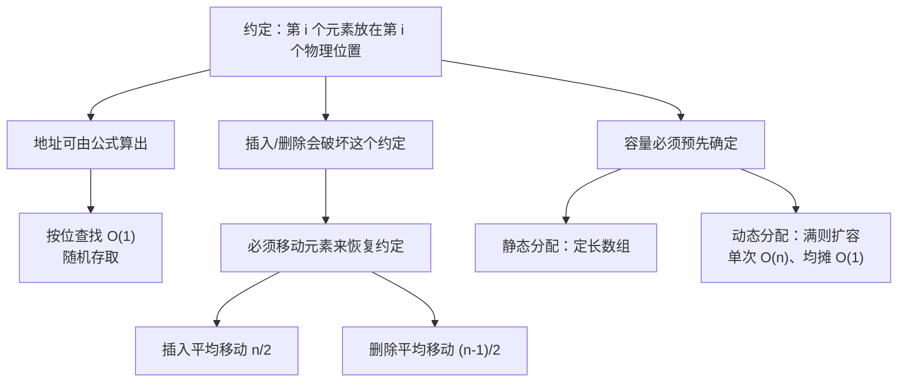

# 顺序表详解：插入、删除、按值查找

> 本文改写自 [CodeBrick 408 数据结构讲义 · 顺序表详解](https://www.codebrick.tech/ds-blog/posts/linear/sequential-list)，原文链接保留。

## 0. 这一节在问什么

三个问题：

1. 顺序表的所有性质，**能不能从一条约定推出来**？
2. 为什么**插入要从后往前搬、删除要从前往后搬**？
3. **「动态分配」为什么不算链式存储**？

---

## 1. 一条约定，推出全部性质

顺序表只有一条约定：**第 $i$ 个元素存放在第 $i$ 个物理位置上。** 本篇剩下的所有性质，都是这一条的推论。

### 红利：随机存取

既然位置是固定的，那么第 $i$ 个元素的地址就能算出来：

$$\boxed{\mathrm{LOC}(a_i)=\mathrm{LOC}(a_1)+(i-1)\times d}$$

$d$ 是每个元素占用的存储单元数。这是一次乘法加一次加法，**与 $i$ 的大小无关**——取第 1 个和取第 100 万个一样快，这就是**随机存取**。

### 账单：插删必须移动元素

插入和删除会**破坏**这条约定：在中间插一个元素，后面每个元素的「第 $i$ 个」身份都往后挪了一位；删一个则往前挪。

要让约定继续成立，就只能**把元素搬回它该在的物理位置上**——这就是顺序表插删必须移动元素的**全部原因**。



::: warning 贯穿全篇的错位
**位序从 1 数，数组下标从 0 数**，第 $i$ 个元素存在 `data[i-1]`。

顺序表代码写错，多半就错在这个 1 上。
:::

---

## 2. 存储结构：静态 vs 动态

### 静态分配

```c
#define MaxSize 50            // 容量上限，编译期确定

typedef struct {
    ElemType data[MaxSize];   // 定长数组，直接嵌在结构体里
    int length;               // 当前表长（元素个数），不是容量
} SqList;
```

::: info last 与 length 两种记法
`last` 记的是最后一个元素的**下标**（空表 `last = -1`），`length` 记**元素个数**（空表 `length = 0`）。

两套等价（`last = length - 1`），但**同一份代码里必须只用一套**。
:::

### 动态分配的均摊分析

:::: details 扩容代码与「均摊 O(1)」怎么来的
```c
#define InitSize 10

typedef struct {
    ElemType *data;   // 只存基地址，真正的空间用 malloc 在堆上申请
    int MaxSize;      // 当前容量，可变
    int length;       // 当前表长
} SeqList;

void IncreaseSize(SeqList &L, int len) {
    ElemType *p = L.data;
    L.data = (ElemType *)malloc(sizeof(ElemType) * (L.MaxSize + len));
    for (int i = 0; i < L.length; i++)
        L.data[i] = p[i];        // 逐个搬到新空间，这一步是 O(n)
    L.MaxSize += len;
    free(p);                      // 释放老空间，否则内存泄漏
}
```

单次扩容要复制全部 $n$ 个元素，代价 $O(n)$，但扩容不是每次插入都发生。

按**倍增**策略连续插入 $n$ 个元素，发生复制的时刻是容量为 $1,2,4,8,\dots$ 的那几次，总复制次数：

$$1 + 2 + 4 + \dots + 2^{\lfloor \log_2 n \rfloor} < 2n$$

平摊到 $n$ 次插入上，每次分担的扩容开销小于 2 次元素复制，即**均摊 $O(1)$**。

::: warning 均摊 O(1) 依赖倍增策略
如果扩容策略是「每次固定加 $c$ 个位置」而非倍增，则扩容发生 $n/c$ 次、每次复制 $O(n)$，总代价 $O(n^2/c)$，均摊退化为 $O(n)$。

**这个结论不是无条件成立的。**
:::
::::

### 关键区分：动态分配 ≠ 链式存储

::: warning 概念上最容易滑过去的一处
动态分配只把「什么时候申请这块连续空间」从编译期推迟到了运行期。

申请到手的**仍然是一整块地址连续的空间**，第 $i$ 个元素仍在第 $i$ 个物理位置上，地址公式照样成立，随机存取照样 $O(1)$。

**真正区分顺序存储与链式存储的是「逻辑相邻是不是等于物理相邻」，不是「空间什么时候申请」。**
:::

---

## 3. 四个基本操作

```c
// 按位查找：直接算地址，一步到位
bool GetElem(SqList L, int i, ElemType &e) {
    if (i < 1 || i > L.length) return false;  // 位序从 1 起算
    e = L.data[i - 1];                        // 位序 i ↔ 下标 i-1
    return true;
}

// 按值查找：从头逐个比较，返回位序（不是下标）；0 是非法位序，可作失败标志
int LocateElem(SqList L, ElemType e) {
    for (int i = 0; i < L.length; i++)
        if (L.data[i] == e) return i + 1;
    return 0;
}

// 插入：在第 i 个位置之前插入 e，第 i ~ 第 n 个元素依次后移一位
bool ListInsert(SqList &L, int i, ElemType e) {
    if (i < 1 || i > L.length + 1) return false;  // 插入的合法范围比删除多一个 n+1
    if (L.length >= MaxSize) return false;        // 表满，静态分配下无法插入
    for (int j = L.length; j >= i; j--)           // 必须从后往前，否则前面的值被覆盖
        L.data[j] = L.data[j - 1];
    L.data[i - 1] = e;
    L.length++;
    return true;
}

// 删除：删掉第 i 个元素，第 i+1 ~ 第 n 个元素依次前移一位
bool ListDelete(SqList &L, int i, ElemType &e) {
    if (i < 1 || i > L.length) return false;   // 删除的合法范围没有 n+1
    e = L.data[i - 1];                          // 先取出被删元素的值
    for (int j = i; j < L.length; j++)          // 从前往后，把后面的往前挪
        L.data[j - 1] = L.data[j];
    L.length--;
    return true;
}
```

### 循环方向为什么相反

::: tip 一句话就能判断，不用死记
**先动的那一格，必须是马上要被覆盖掉的那一格。**

- 插入：空位在**后面** → 从**后往前**搬
- 删除：空位在**前面** → 从**前往后**搬
:::

::: warning 写反的症状很有辨识度
同一个值会被**复制满整段区间**。
:::

### 合法范围

| 操作 | 合法范围 | 备注 |
|:---|:---|:---|
| 插入 | $1 \le i \le n+1$ | 多出的 $n+1$ 对应「插在表尾之后」，**移动 0 个元素** |
| 删除 | $1 \le i \le n$ | 没有 $n+1$ |

::: details 四个边界的逐格自查
**插入**：
- $i=n+1$（表尾之后）：循环一次不执行，移动 **0** 个元素
- $i=1$（表头）：移动 **$n$** 个元素，代价最大
- 空表插入 $i=1$：循环不执行，`data[0]=e`，`length` 变 1，正确

**删除**：
- $i=n$（表尾）：循环不执行，移动 **0** 个元素
- $i=1$（表头）：移动 **$n-1$** 个元素，代价最大
- 空表删除：`length=0`，$i\ge 1>0$ 触发合法性判断，返回 `false`，正确

删除后落在表外的残值**不需要清除**——`length` 已减 1，任何合法操作都不会读到它。
:::

::: warning 按值查找是 O(n)，表有序也仍是 O(n)
上面的 `LocateElem` **根本没利用有序性**。

要降到 $O(\log_2 n)$ 必须换算法（折半查找），而折半查找成立的前提恰恰是顺序表的**随机存取**。
:::

---

## 4. 一次插删要搬多少个元素

$$\boxed{E_{\text{ins}} = \frac{n}{2}, \qquad E_{\text{del}} = \frac{n-1}{2}}$$

### 为什么差一点

::: tip 记住结构比记式子可靠
插入有 $n+1$ 个合法位置、删除只有 $n$ 个；对应地，插入的移动次数取遍 $\{0,1,\dots,n\}$，删除取遍 $\{0,1,\dots,n-1\}$。

两个式子其实在算**同一件事**——一个从 0 到某上界的等差数列的平均值，上界分别是 $n$ 和 $n-1$。

记住这个结构，换成问「最坏移动多少次」也能立刻答上来（分别是 $n$ 和 $n-1$）。
:::

按值查找的平均比较次数同理，等概率下是 $\dfrac{n+1}{2}$ 次。

::: warning 「等概率」是显式前提，不是恒成立的事实
题目若改成「只在表尾插入」，平均移动次数是 0；改成「只在表头插入」，就是 $n$。

**看到「平均」二字，先找它的概率假设。**
:::

:::: details 三个平均值的完整求和推导
**插入**：在第 $i$ 个位置插入需移动 $n-i+1$ 个元素，等概率 $p_i=\dfrac{1}{n+1}$：

$$E_{\text{ins}} = \frac{1}{n+1}\sum_{i=1}^{n+1}(n-i+1) = \frac{1}{n+1}\cdot\frac{n(n+1)}{2} = \frac{n}{2}$$

**删除**：删除第 $i$ 个元素需移动 $n-i$ 个，等概率 $p_i=\dfrac{1}{n}$：

$$E_{\text{del}} = \frac{1}{n}\sum_{i=1}^{n}(n-i) = \frac{1}{n}\cdot\frac{n(n-1)}{2} = \frac{n-1}{2}$$

**按值查找**：$C_i=i$，等概率 $p_i=1/n$：

$$\mathrm{ASL} = \frac{1}{n}\sum_{i=1}^{n} i = \frac{n+1}{2}$$
::::

### 插入与删除对读

| | 插入 | 删除 |
|:---|:---:|:---:|
| 合法位置数 | $n+1$ | $n$ |
| 在位置 $i$ 的移动次数 | $n-i+1$ | $n-i$ |
| 移动次数取值集合 | $\{0,1,\dots,n\}$ | $\{0,1,\dots,n-1\}$ |
| 最大移动次数（$i=1$） | $n$ | $n-1$ |
| 平均移动次数 | $\dfrac{n}{2}$ | $\dfrac{n-1}{2}$ |

---

## 5. 真题怎么考

| 考法 | 要点 |
|:---|:---|
| **哪个操作平均时间是 $O(1)$** | 四个选项里只有**按位取值**是 $O(1)$。「有序表」三个字是干扰——顺序查找不会因为有序变快 |
| **哪些操作必然引起元素移动** | 表头插入/删除**必然移动**；表尾插入/删除一个都不用动。依据是「约定被破坏在哪一段」 |
| **换成链式后哪些算法变慢** | 依赖**随机存取**的算法都会退化——希尔排序按增量跳着取元素、堆排序按下标算孩子结点 |
| **大题里当数组用** | 循环左移、找主元素、两升序序列中位数等，通常要求 $O(n)$ 时间 + $O(1)$ 辅助空间 |

---

## 6. 易错清单

::: warning 易错一：插入与删除的移动方向写反
插入从**后往前**、删除从**前往后**。

判断依据是「先动的那一格必须是马上要被覆盖掉的那一格」；写反的症状是同一个值复制满整段。
:::

::: warning 易错二：把「动态分配」当成链式存储
它拿到的仍是**一整块连续空间**，随机存取照样 $O(1)$。

区分顺序与链式的标准是「**逻辑相邻是否等于物理相邻**」。
:::

::: warning 易错三：位序与下标错位 1
位序从 1 起、下标从 0 起，第 $i$ 个在 `data[i-1]`；插入合法范围 $1\le i\le n+1$，删除只到 $n$。
:::

---

## 7. 速记

::: tip 三条会被反复调用
1. 一切都来自那条约定——**第 $i$ 个元素放在第 $i$ 个物理位置**。随机存取是红利，插删要移动元素是账单
2. **按位查找 $O(1)$，按值查找、插入、删除都是 $O(n)$**，辅助空间一律 $O(1)$
3. **存储密度恒为 1**，这是顺序表相对链表唯一的空间优势；一旦按上限预分配出大片空闲区，优势就被抵消
:::

---

> 本文改写自 CodeBrick 408 数据结构讲义：[顺序表详解：插入、删除、按值查找](https://www.codebrick.tech/ds-blog/posts/linear/sequential-list)
